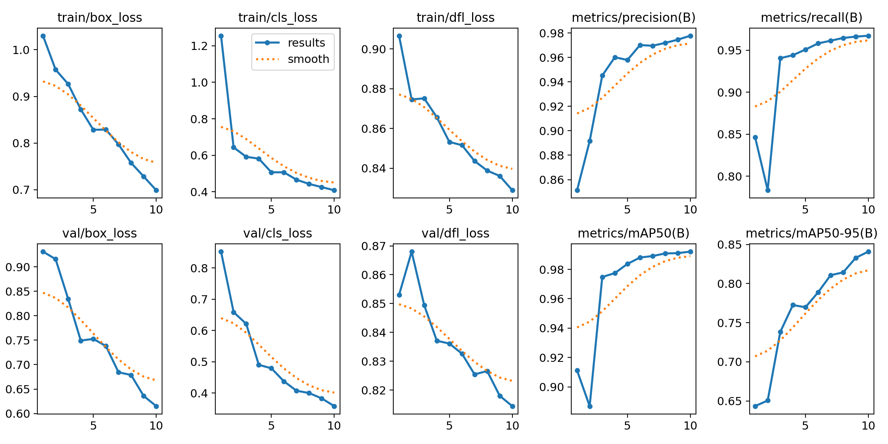
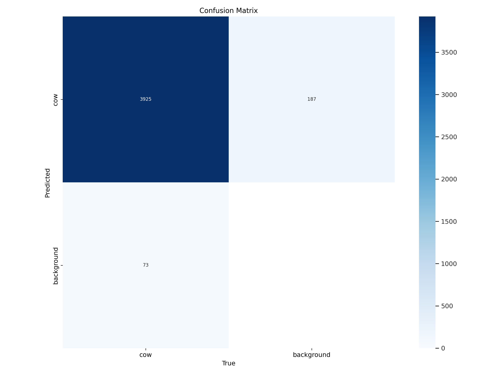

# Cattle Grazing Detector with YOLOv11

## Overview
This project is a Streamlit-based web application designed to detect cattle in aerial images and videos using a fine-tuned YOLOv11 model. The tool is built to assist farmers, researchers, and livestock managers in monitoring grazing patterns, assessing herd distribution, and ensuring the well-being of cattle.

## Features
- **Cattle Detection in Images and Videos**: Upload images or videos, and the application will identify and highlight cattle in the footage.
- **Real-Time Processing**: Optimized for real-time detection to support practical field applications.
- **User-Friendly Interface**: Simple and intuitive interface for seamless user experience.

## How It Works
1. **Data Upload**: Users can upload images (jpg, jpeg, png) or videos (mp4, avi, mov) for detection.
2. **Model Processing**: The application runs the fine-tuned YOLOv11 model to identify cattle.
3. **Output Display**: Detected cattle are marked with bounding boxes, and a summary of detections is provided.

## Training Details
- **Model Architecture**: YOLOv11, a state-of-the-art object detection model, was selected for its speed and accuracy.
- **Training Data**: High-resolution aerial images and videos, annotated with cattle locations.
- **Pre-Processing**: Included image resizing, augmentation (rotations, flips, color adjustments) to improve model robustness.
- **Training Process**: Fine-tuning was performed using transfer learning, with hyperparameter tuning for optimal performance.
- **Evaluation Metrics**:
  - Precision and Recall
  - Mean Average Precision (mAP)
  - Inference time for real-time applicability

### Model Performance
Below are key performance visualizations:
- **Training Metrics**: 
- **Confusion Matrix**: 

## Running Streamlit App Locally 
1. **Clone the repository**:
   ```bash
   git clone https://github.com/username/cattle-grazing-detector.git
   cd cattle-grazing-detector
   ```
2. **Install Dependencies**:
    ```bash
   pip install -r requirements.txt
   ```
3. **Run the Streamlit app:**:
   ```bash
   streamlit run app.py
   ```
## Further finetuning the model
1. 1. **Download the Pre-trained Weights**: Download the file 'yolo11ft.pt', which contains the pre-trained weights of the model.
2. 2. **Load the Weights**: Load the weights onto the YOLOv11 model using the following code:
   ```python
    from ultralytics import YOLO
    # Load the model with pre-trained weights
    model = YOLO('yolo11ft.pt')
   ```
3. **Prepare Your Custom Dataset**: Ensure that your dataset is in the correct format, with images and corresponding label files in YOLO format (text files with bounding box coordinates).
4. **Fine-Tuning**: Run the training process with your custom dataset:
   ```python
   model.train(data='path/to/your/data.yaml', epochs=50, imgsz=640)
   ```
   - Adjust epochs and imgsz as needed
5. **Evaluate the Model**: After training, evaluate the model's performance:
   ```python
   results = model.val()
   print(results)
   ```

## Future Improvements
- **Dataset Expansion**: Incorporating more complex scenarios and different livestock types.
- **Real-Time Tracking**: Adding additional features for live tracking and analysis.
- **Cloud Deployment**: Implementing cloud-based services for scalability and broader accessibility.

## Acknowledgements
- The YOLO community for continuous advancements in object detection technology.
- SORT: A Simple, Online and Realtime Tracker Copyright (C) 2016-2020 Alex Bewley alex@bewley.ai
- Data used to train from: https://universe.roboflow.com/detection-kvliu/cow_detect
